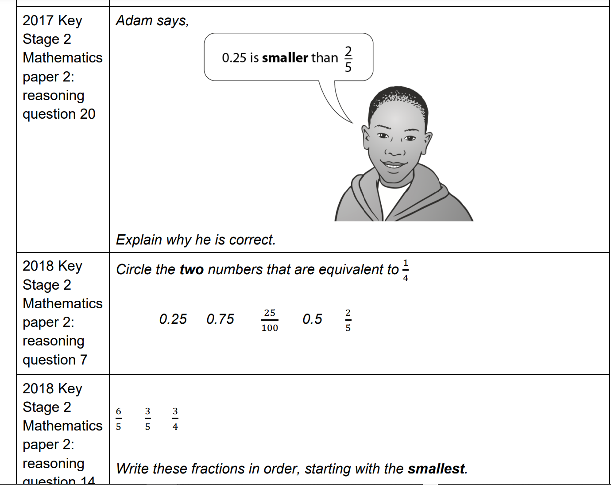
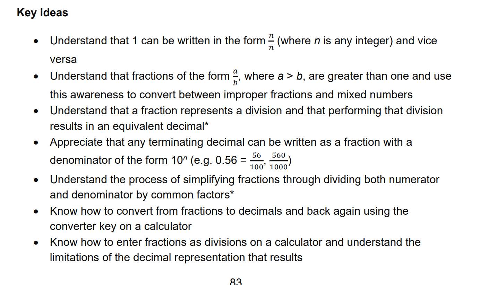
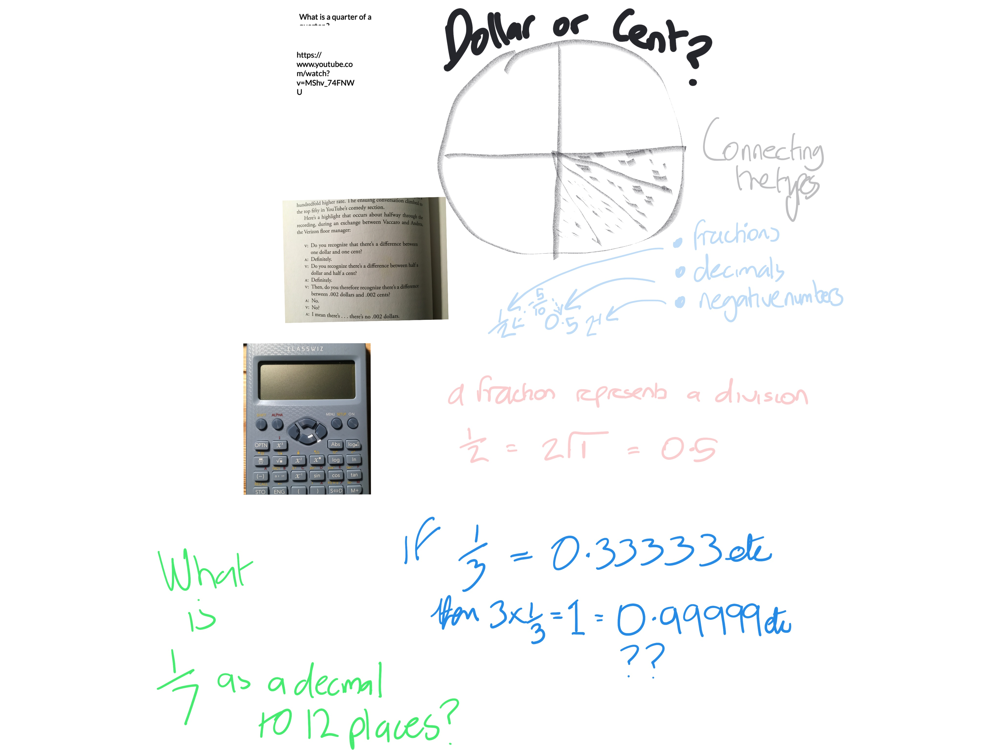

<head>
  <meta charset="UTF-8">
  <meta name="description" content="fractions">
  <meta name="keywords" content="fractions,decimals,percentages,ks3">
  <meta name="author" content="andrewdonov">
  <meta name="viewport" content="width=device-width, initial-scale=1.0">
</head>
<h1>Fractions in year 7 </h1>

Checking our understanding from Key Stage 2

What are the aims for Key Stage 3 ?

<h4>Fractional billing can be a headache ! Some things just do not add up !</h4>
